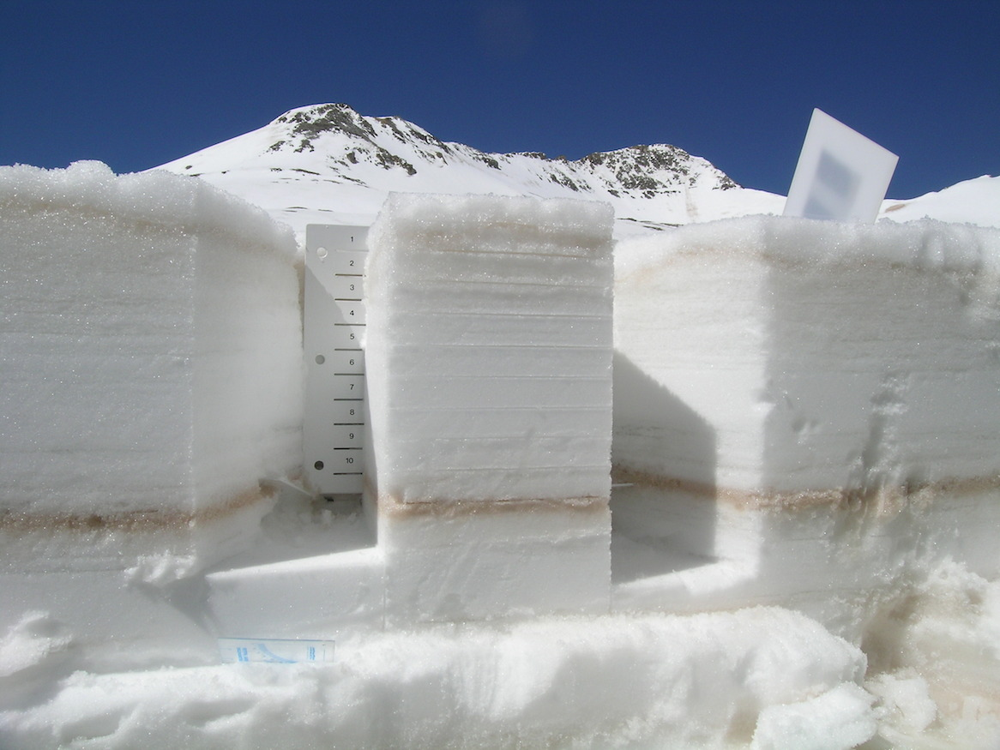

snowpack
========

__A lambda function written in NodeJs that runs in [AWS Lambda](http://aws.amazon.com/lambda/)__

1. Augments stored tracking data with additional information (geo, weather, etc) following the patterns
   * [chain of responsibility](http://en.wikipedia.org/wiki/Chain-of-responsibility_pattern) using [chainof](https://www.npmjs.com/package/chainof)
   * [decorator](http://en.wikipedia.org/wiki/Decorator_pattern)
2. Stores final decorated object in [S3](http://aws.amazon.com/s3/)
3. Decorators
   * geo information from ip: [ipinfo.io](http://ipinfo.io/) using [node-curl](https://www.npmjs.com/package/node-curl)
   * weather information from [noaa](http://www.noaa.gov/wx.html) using [weathers](https://www.npmjs.com/package/weathers)

